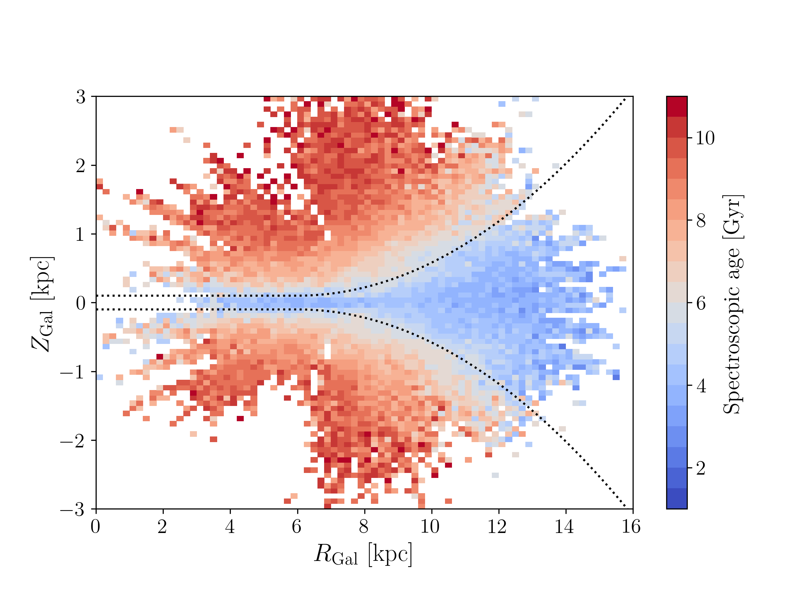

# xgboost_chem_ages

## Estimating spectroscopic stellar ages for APOGEE red-giant stars

We estimate spectroscopic stellar ages for 179 247 red-giant stars from the APOGEE DR17 catalogue [(Abdurro'uf et al. 2022)](https://ui.adsabs.harvard.edu/abs/2022ApJS..259...35A/abstract) with a median statistical uncertainty of 1.0 Gyr. To this end, we use the supervised machine learning technique XGBoost [(Chen & Guestrin 2016)](https://ui.adsabs.harvard.edu/abs/2016arXiv160302754C/abstract), trained on a high-quality dataset of 3 060 red-giant and red-clump stars with asteroseismic ages observed by both APOGEE and Kepler [(Miglio et al. 2021)](https://ui.adsabs.harvard.edu/abs/2021A%26A...645A..85M/abstract). 

### 

This repository contains the jupyter notebooks that allow you to reproduce the figures and analysis presented in [Anders, Gispert, Ratcliffe, et al. 2023,  almost subm.)](arxiv.org/TBD):

* [train_xgboost_miglio2021.ipynb](py/train_xgboost_miglio2021.ipynb): Creating the training set, running XGBoost, and predicting ages for the APOGEE DR17 data. Reproduces Figs. 1-4 in the paper.
* [test_age_catalogues.ipynb](py/test_age_catalogues.ipynb): Comparing the age estimates with other independent age determinations (CoRoT, K2, TESS, open clusters, [C/N] calibrations, astroNN, StarHorse, ...). Reproduces Figs. 5, 6, & A.1 in the paper.
* [test_ages_science.ipynb](py/test_ages_science.ipynb): Testing the age estimates on some typical age-chemokinematics relations (Age-metallicity, age-[Mg/Fe] relations, radial abundance gradient as a function of age, age-velocity relation). Reproduces Figs. 7-13, A.2, A.3, B.1 in the paper.

Comments, questions, feedback are welcome: fanders[ät]icc.ub.edu
